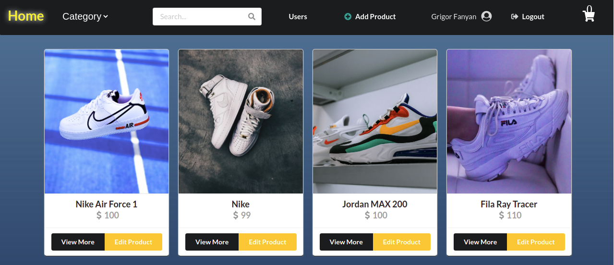
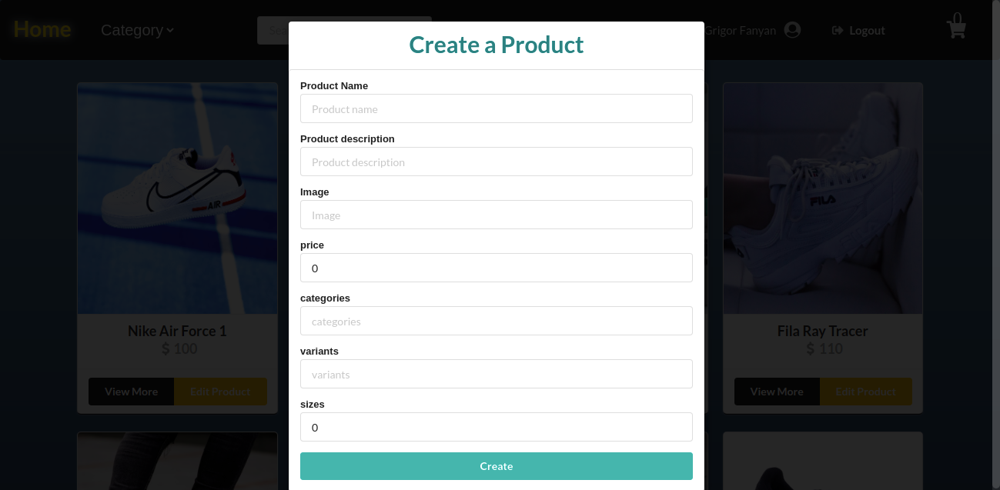

# Shoes E-Commerce Store.

> FUll-Stack Project

## Table of contents

- [Title](#Title)
- [General info](#general-info)
- [Screenshots](#screenshots)
- [Technologies](#technologies)
- [Features](#features)
- [Status](#status)
- [Inspiration](#inspiration)
- [Contact](#contact)

## Title

Shoes E-Commerce Store.

## General info

A full-stack application that has a wide range of functionalities and features that would be
essential to modern e-commerce platforms, such as CRUD functions, registering and logging
in with validation, responsiveness, and accessibility.

## Screenshots

## Technologies

- React.js
- Redux
- Redux-thunk
- TypeScript
- Semantic UI
- Local Storage
- Formik
- Express.js
- JWT
- MongoDB
- Mongoose
- Docker

## Features

List of features READY and TODOs for future development

READY:

- Search filter
- Select by category
- View single Product
- Add Product to Cart
- Remove Product
- Login with validation
- Register with validation
- Google Login
- Logout
- Save in Local Storage
- Admin
- Create new Product
- Update Product
- Responsiveness
- Pagination
- Deployed in Heroku

To-do list:

- Update user

## Status

Project is: _in progress_

## Inspiration

[Project](https://e-commerce-shoes-app.herokuapp.com/) is created for educational purposes

## Contact

Created by [Grigor Fanyan](https://www.linkedin.com/in/gregfanyan/) - feel free to contact me!
