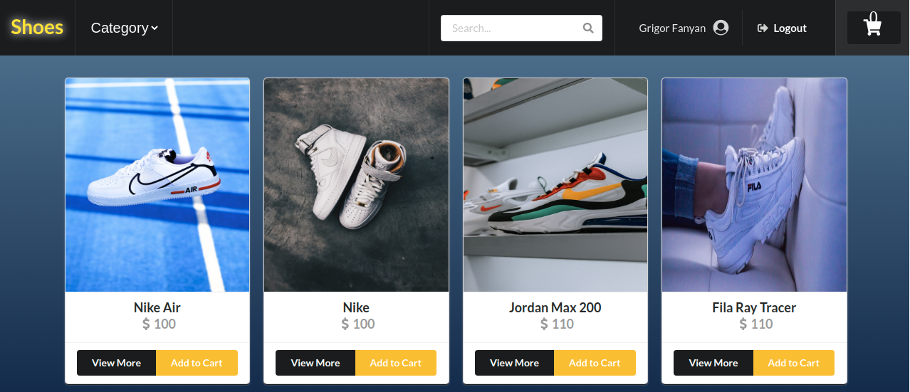
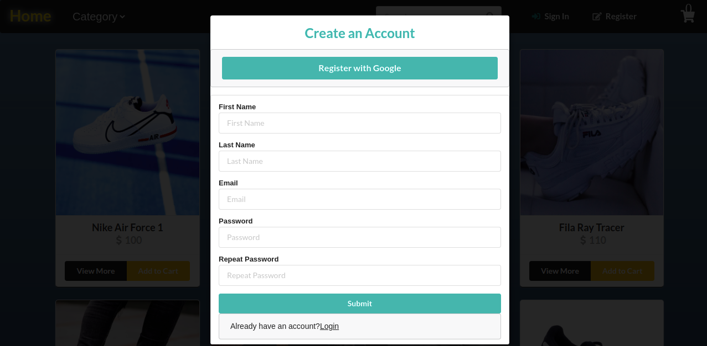
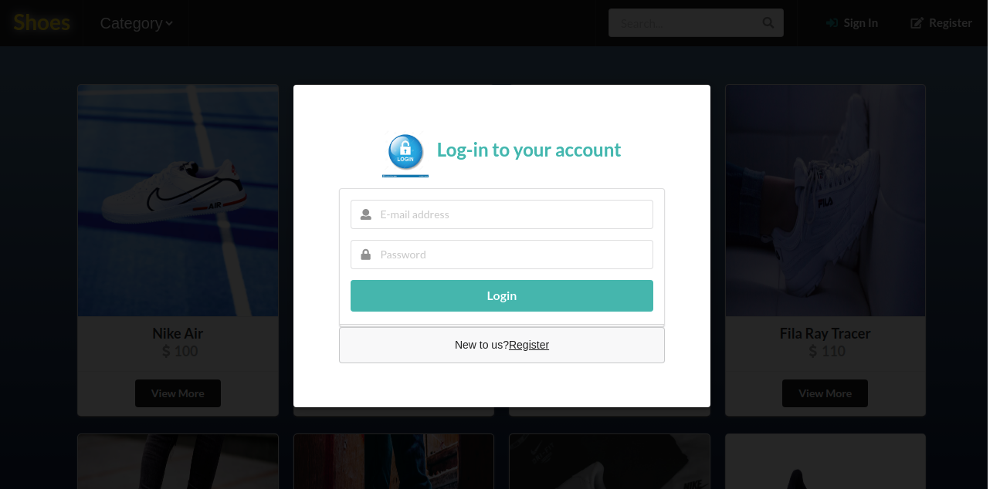
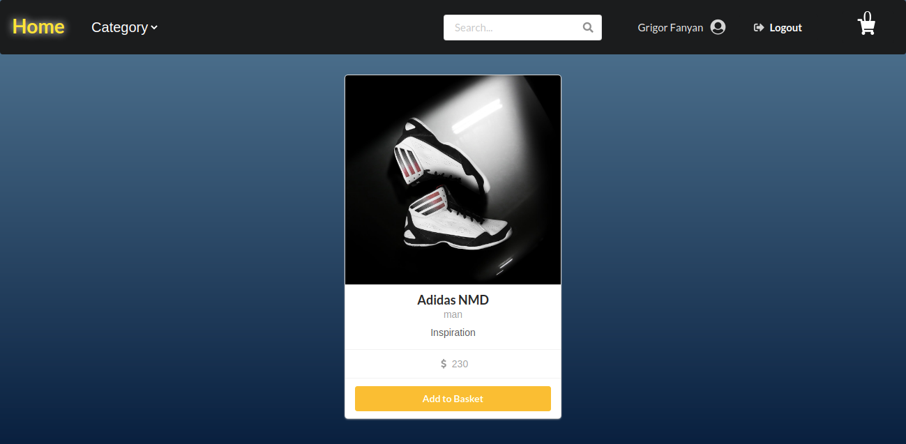

# Shoes E-Commerce Store.

> FUll-Stack Project

## Table of contents

-   [General info](#general-info)
-   [Screenshots](#screenshots)
-   [Technologies](#technologies)
-   [Features](#features)
-   [Status](#status)
-   [Inspiration](#inspiration)
-   [Contact](#contact)

## General info

Shoes E-Commerce Store. 

## Screenshots

## Technologies

-   React.js
-   Redux
-   TypeScript
-   Semantic UI
-   Local Storage
-   Express.js
-   JWT
-   MongoDB

## Features

List of features ready and TODOs for future development

-   Search filter
-   Select by category
-   View single Product
-   Added Redux
-   Add Product to Cart
-   Remove Product
-   Login with validation
-   Register with validation
-   Logout
-   save and show current user
-   Save in Local Storage

To-do list:

-   Add Admin
-   Create new Product
-   Responsive Design
-   Pagination
-   Update user
-   Update Product
-   Add google login
-   Create Docker Image
-   Deploy in Heroku or Netlify

## Status

Project is: _in progress_

## Inspiration

Project is created for educational purposes

## Contact

Created by [Grigor Fanyan](https://www.linkedin.com/in/gregfanyan/) - feel free to contact me!
